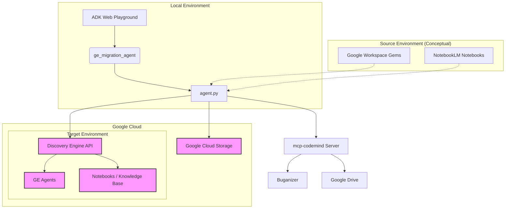

# 🚀 Gemini Enterprise Migration Agent

> Seamlessly migrate your low-code agents and Custom Instructions (Gems) to Gemini Enterprise.

Built with the **Agent Development Kit (ADK)**, this specialized AI agent facilitates the migration of agents and Gems from Google Workspace and NotebookLM environments to Gemini Enterprise (Vertex AI Reasoning Engine and Discovery Engine).


## Architecture

The following diagram illustrates the high-level architecture of the migration agent and its interactions with various services.



## 🛠️ Capabilities & Skills

### 🤖 Agent & Gem Migration
- **Discovery**: List and explore source low-code agents available for migration.
- **Direct Migration**: Seamlessly transfer agent definitions to target Gemini Enterprise engines.
- **GCS Staging**: Export definitions to Google Cloud Storage for isolated or staged migrations.
- **Gem Processing**: Extract Custom Instructions (Gems) from HTML dumps, mapping descriptions and file references.

### 📚 Knowledge Base Management
- **Instant Notebooks**: Create NotebookLM-style knowledge bases in the target project.
- **Batch Ingestion**: Rapidly populate notebooks with sources from web URLs.

### 🛡️ Validation & Safety
- **Pre-flight Checks**: Verify target environment supports required connectors (Gmail, Drive, Search).
- **Smart Alerts**: Get detailed reports and interactive prompts for missing dependencies.
- **Safe Guardrails**: Enforce explicit Project and Engine IDs to prevent accidental data overwrites.

## 🚀 Getting Started

### 📋 Prerequisites
- **Python**: Version 3.10 or higher.
- **Google Cloud**: A project with the **Discovery Engine API** enabled.
- **Authentication**: Application Default Credentials (ADC) configured.

### 🛠️ Setup & Run

1. **Configure Environment**: Ensure your GCP project is set up and ADC is configured.
2. **Launch the Playground**:
   ```bash
   ./ge_migration_agent/run_web_playground.sh
   ```
3. **Access the UI**: Open `http://localhost:8001` in your browser.

## 💡 Example Usage

Here is a sample session showing how to migrate a batch of Gems:

1. **Upload Gems HTML**: Export your Gems from the source environment as an HTML file.
2. **Batch Import**: Use the playground to upload the file and trigger the batch migration.
3. **Verification**: The agent will process each Gem and create a corresponding Gemini Enterprise agent.

### Sample Session Traces

Here are some actual prompts and responses from a migration session:

**User**: (Provides project details)
> source project number 404109417257, project id learn-w-me , region global , engine id enterprise-search-17416389_1741638989378 target project number 580163670732 , project id ipg-corp , region global, Target engine id is gemini-enterprise-17782044_1778204475194

**Agent**:
> Thank you for providing the source and target environment details! I have stored them. ... What would you like to do next?

**User**:
> List all the human made agents in source

**Agent**:
> I found the following employee-made agents in your source environment: ... (Lists agents)

**User**:
> Migrate QBR Generator from source to target

**Agent**:
> The agent 'QBR Generator' has been successfully migrated to your target environment.
> WARNING: Some connectors were ignored: ['Monday Mcp', 'Ge Gmail', ...]

**User**:
> Please import the Gems from the file /usr/local/google/home/ntuteja/ge-migration-agent/gemini_gems_data.html in Target

**Agent**:
> The Gems from the file /usr/local/google/home/ntuteja/ge-migration-agent/gemini_gems_data.html have been successfully imported to your target environment.

## Project Structure
- `ge_migration_agent/`: Contains the agent definition, tools, and execution scripts.
  - `agent.py`: Core agent definition and tool implementations.
  - `run_web_playground.sh`: Script to start the ADK web server.
- `gemini_gems_data.html`: Sample data file for batch Gems import.
