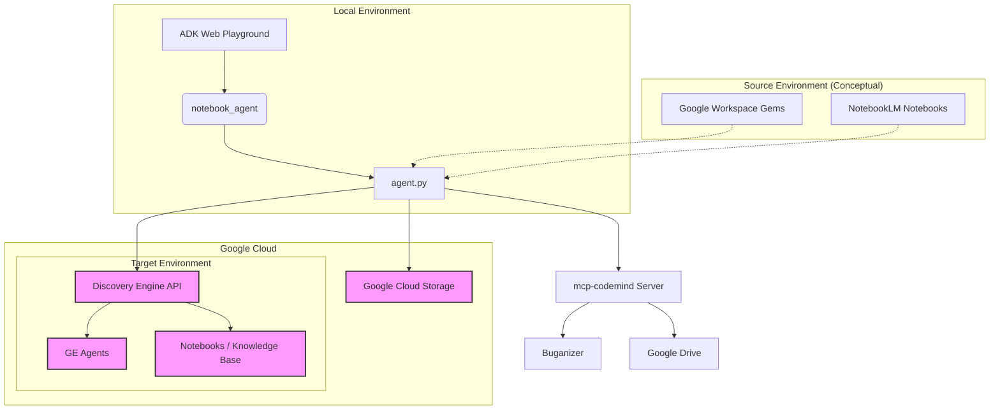

# Gemini Enterprise Migration Agent

This project provides a specialized AI agent built with the Agent Development Kit (ADK) to facilitate the migration of low-code agents and Custom Instructions (Gems) from Google Workspace and NotebookLM environments to Gemini Enterprise (Vertex AI Reasoning Engine and Discovery Engine).

## Architecture

The following diagram illustrates the high-level architecture of the migration agent and its interactions with various services.



## Key Features

### 1. Agent Migration
- **List & Discover**: List available source low-code agents.
- **Direct Migration**: Migrate agent definitions directly to target Gemini Enterprise engines.
- **GCS Isolation**: Export agent definitions to GCS and import them into target environments, enabling isolated migration flows.

### 2. Gems Migration
- **Single Gem Import**: Create a GE agent from a single Gem definition (Name & Instructions).
- **Batch Import**: Parse an HTML dump of Gems and create multiple GE agents in one go.
- **Description Mapping**: Maps Gem descriptions to agent metadata.
- **File Reference Mapping**: Parses attached file links and appends them to instructions as references.

### 3. Knowledge Base (Notebooks) Management
- **Notebook Creation**: Ability to create notebooks in the target project to serve as knowledge bases.
- **Source Ingestion**: Batch add sources (e.g., web URLs) to notebooks to populate them with knowledge.

### 4. Validation & Safeguards
- **Connector Validation**: Checks if target environment supports required connectors (Gmail, Drive, Search) before migration.
- **Missing Dependency Reporting**: Generates a report of missing connectors.
- **Interactive Confirmation**: Prompts user before migrating with missing dependencies.
- **Target Enforcement**: Forces explicit specification of target Project ID and Engine ID to prevent accidental overrides.

## Getting Started

### Prerequisites
- Python 3.10+
- Access to a Google Cloud project with Discovery Engine API enabled.
- Application Default Credentials (ADC) configured.

### Running the Playground
To start the interactive web playground:

```bash
./notebook_agent/run_web_playground.sh
```

Access the UI at `http://localhost:8001`.

## Project Structure
- `notebook_agent/`: Contains the agent definition, tools, and execution scripts.
  - `agent.py`: Core agent definition and tool implementations.
  - `run_web_playground.sh`: Script to start the ADK web server.
- `gemini_gems_data.html`: Sample data file for batch Gems import.
